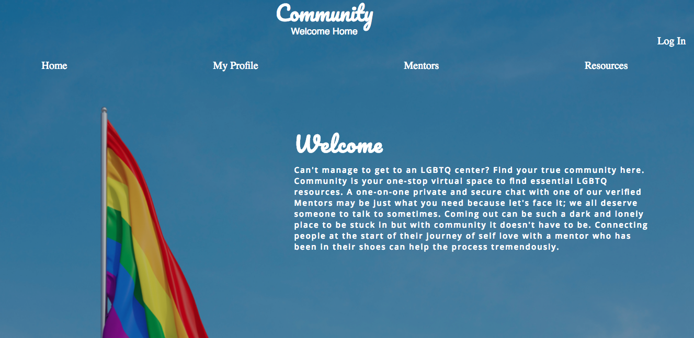

# Community

Community is your one-stop virtual space to find essential LGBTQ resources. A one-on-one private and secure chat with one of our verified Mentors may be just what you need because let's face it; we all deserve someone to talk to sometimes. Coming out can be such a dark and lonely place to be stuck in but with community it doesn't have to be. Connecting people at the start of their journey of self love with a mentor who has been in their shoes can help the process tremendously.

[LiveSite](https://community-home.herokuapp.com/)

# Technolgy Used
Front-end:
[React](https://reactjs.org/docs/getting-started.html)
[Socket.io](https://socket.io/)
[Semanitic-UI](https://react.semantic-ui.com/)

[Back-end/Link to repo](https://github.com/Taylor4980/community-back-end)
[Express](http://expressjs.com/en/starter/hello-world.html)
[PostgreSQL](https://www.postgresql.org/)
[Heroku](https://signup.heroku.com/?c=70130000001xDpdAAE&gclid=CjwKCAjwtIXbBRBhEiwAWV-5nn5W5bscq0tG8A58Z3YROJgx5UnXvi5gr2d4lzioxUsLLKR40U4HLRoC5n8QAvD_BwE)

# Get locally & Install 

Fork and clone repo
cd into folder, then cd into app folder
install npm (npm install in CLI)
run npm start (this will run the application locally)
to run the server fork and clone back-end repo then in CLI run (run server)
